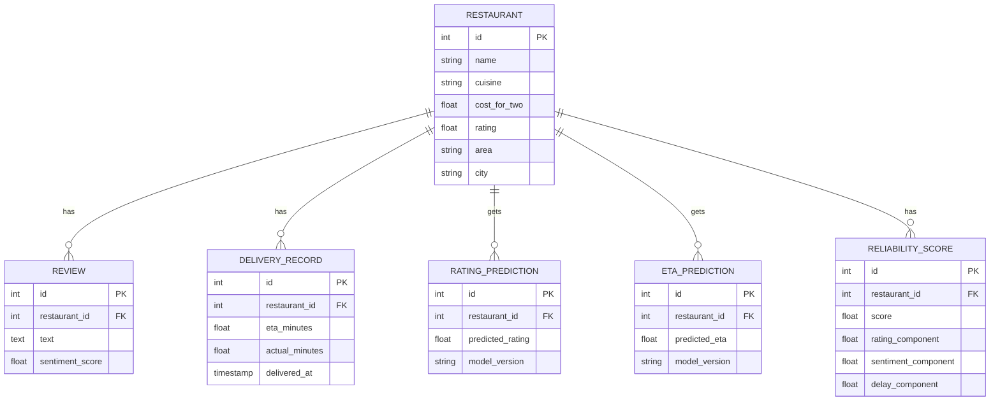

# Schema — Dabba: Data Model

| Field | Value |
|---|---|
| Version | v0.1 |
| Last Updated | 2026-08-06 |
| Owner | Data Engineer |
| Status | In Review |

---

## 1. ER Diagram



## 2. Table/Collection Definitions

### TBL-restaurant
| Field | Type | Nullable | Default | Constraints | Description |
|---|---|---|---|---|---|
| id | int PK | No | auto | — | PK |
| name | string | No | — | — | name |
| cuisine | string | Yes | — | — | cuisine |
| cost_for_two | float | Yes | — | ≥ 0 | cost |
| rating | float | No | — | 0..5 | rating |
| area | string | Yes | — | — | area |
| city | string | No | — | — | city |

### TBL-review
| Field | Type | Nullable | Default | Constraints | Description |
|---|---|---|---|---|---|
| id | int PK | No | auto | — | PK |
| restaurant_id | int FK | No | — | → restaurant | parent |
| text | text | No | — | — | review |
| sentiment_score | float | No | — | −1..1 | VADER |

### TBL-reliability_score
| Field | Type | Nullable | Default | Constraints | Description |
|---|---|---|---|---|---|
| id | int PK | No | auto | — | PK |
| restaurant_id | int FK | No | — | → restaurant | parent |
| score | float | No | — | 0..100 | reliability |
| rating_component | float | No | — | — | 0.4·norm(rating) |
| sentiment_component | float | No | — | — | 0.3·norm(sentiment) |
| delay_component | float | No | — | — | −0.3·norm(delay_risk) |

## 3. Relationships & Foreign Keys

| Table A | Table B | On delete | Justification |
|---|---|---|---|
| review | restaurant | cascade | review dies with restaurant |
| delivery_record | restaurant | cascade | record dies with restaurant |
| reliability_score | restaurant | cascade | score dies with restaurant |

## 4. Indexes

| Table | Index | Columns | Type | Reason |
|---|---|---|---|---|
| restaurant | idx_res_city | (city) | btree | city filter |
| restaurant | idx_res_cuisine | (cuisine) | btree | cuisine filter |
| review | idx_rev_rest | (restaurant_id) | btree | FK lookup |
| reliability_score | idx_rel_score | (score) | btree | ranking sort |

## 5. Enums / Constants

| Enum | Allowed values |
|---|---|
| reliability formula | 0.4·norm(rating) + 0.3·norm(sentiment) − 0.3·norm(delay_risk) |
| DRIFT_THRESHOLD | configurable (e.g., 0.05) |

## 6. Data Lifecycle

- Datasets refreshed on retrain (offline); no live streaming in v1.
- Old model predictions archived; current version flagged.
- Retention: full history retained (small dataset).

## 7. Migrations

- Tool: Alembic (if SQLAlchemy persistence adopted).
- Rollback: `alembic downgrade -1`.

## 8. Sample Records

```json
{
  "restaurant": { "id": 1, "name": "Spice Garden", "cuisine": "North Indian", "rating": 4.2, "city": "Bengaluru" },
  "reliability_score": { "restaurant_id": 1, "score": 87.4, "rating_component": 36.0, "sentiment_component": 28.1, "delay_component": 23.3 }
}
```

## 9. Data Validation Rules

| Field | DB constraint | App layer |
|---|---|---|
| rating | 0..5 | Pydantic |
| sentiment_score | −1..1 | Pydantic |
| score | 0..100 | Pydantic |
| cost_for_two | ≥ 0 | Pydantic |

## 10. Sensitive Data Map

| Field | Sensitivity | Encrypted at rest? | Masked in logs? |
|---|---|---|---|
| restaurant data | none | no | no |
| review text | public-ish | no | no |
| LLM inputs | case data | no | redact PII |
| API keys | credential | env only | never logged |

## 11. Related Documents

| Document | Relationship |
|---|---|
| [API.md](API.md) | Endpoints touching tables |
| [TechSpec.md](TechSpec.md) | Pipeline |
| [PRD.md](PRD.md) | Requirements |
| [AppFlow.md](AppFlow.md) | Flows |
| [Design.md](Design.md) | Display data |
| [ImplementationPlan.md](ImplementationPlan.md) | Tasks |
| [Tracker.md](Tracker.md) | Status |
| [Rules.md](Rules.md) | Standards |
| [SecurityAndCompliance.md](SecurityAndCompliance.md) | Sensitive map |
| [Testing.md](Testing.md) | Data tests |
| [Deployment.md](Deployment.md) | Migrations |
| [Glossary.md](Glossary.md) | Vocabulary |
| [RiskRegister.md](RiskRegister.md) | Risks |
