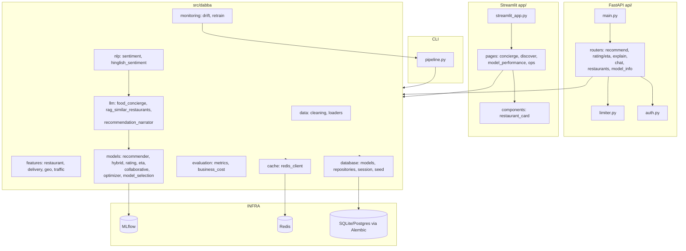

# Dabba — Architecture

> Textual architecture of the Dabba restaurant recommendation platform (as-is; no behavior changes).

## System Overview

Dabba is a layered ML platform with three primary surfaces:

1. **CLI / Pipeline** — `src/dabba/pipeline.py` runs the full training flow (data → features → models → evaluate → register to MLflow).
2. **API (FastAPI)** — REST endpoints for recommendations, ratings, ETA prediction, explanation, restaurant search, and the food concierge chat. Protected by JWT auth and rate limiting.
3. **Dashboard (Streamlit)** — concierge, discover, model-performance, and ops pages.



## Layering Rules (as observed)

- **API layer** (`api/`) depends on `src/dabba/`; never the reverse.
- **Database** access is isolated in `database/repositories.py` (function-based repository layer).
- **Streamlit pages** call the core package directly (no separate API client — unlike FraudLens).
- **LLM features** (concierge, narration, RAG) are wrapped modules with graceful fallbacks.
- **Config** centralized in `src/dabba/config.py` (Pydantic settings).

## Data Flow (recommendation path)

```
GET /v1/recommend ──► auth ──► limiter ──► router ──► repositories ──► features.engineering
                                                              │
                                                              ▼
                                             hybrid recommender (collaborative + content)
                                                              │
                                                              ▼
                                     LLM recommendation narrator (optional)
                                                              │
                                                              ▼
                                                  JSON response
```

## Deployment

- Multi-service containers: `docker/api.Dockerfile`, `docker/streamlit.Dockerfile`, `docker/mlflow.Dockerfile` + `docker-compose.yml`.
- Alembic manages schema; Redis for caching; MLflow for experiment tracking.
- Drift detection can trigger automatic retraining via `monitoring/retrain.py` (subprocess, rate-limited).
