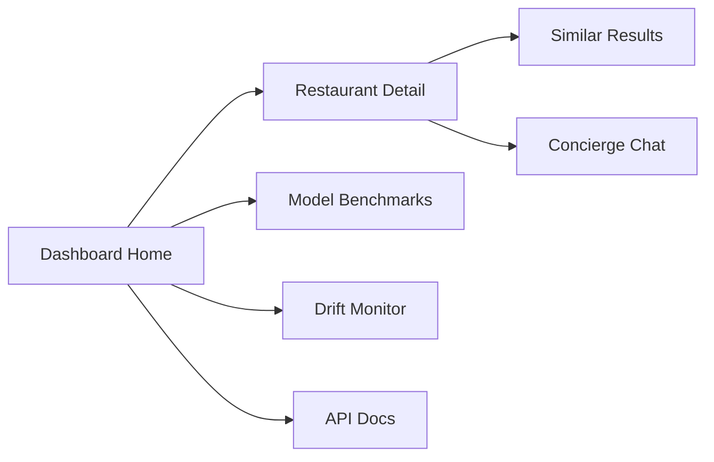
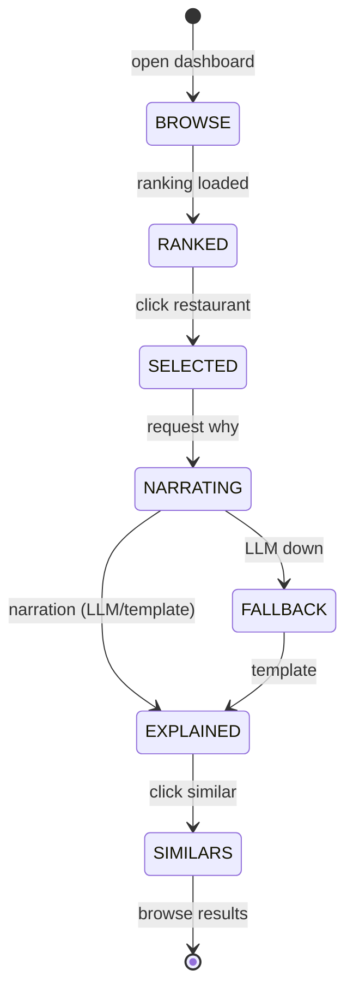
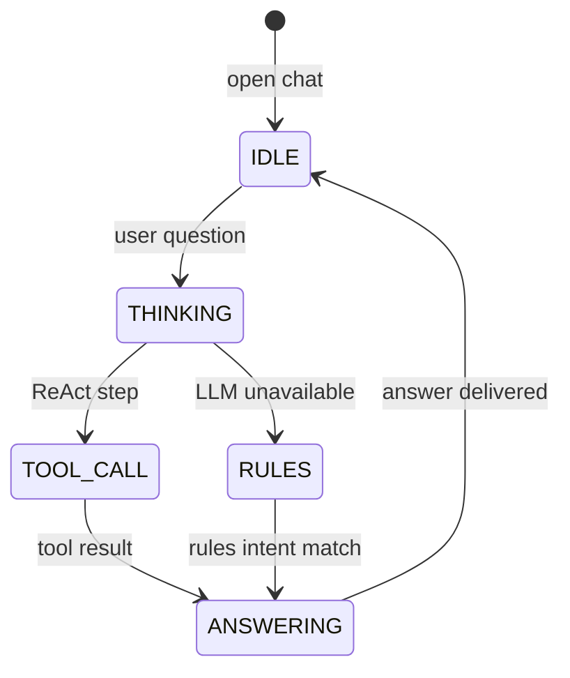

# AppFlow — Dabba: Application Flow

|Field|Value|
|---|---|
|Version|v0.1|
|Last Updated|2026-08-06|
|Owner|PM / QA|
|Status|In Review|

---

## 1. Screen Inventory

|SCR-###|Screen|Purpose|Entry|Exit|Auth|
|---|---|---|---|---|---|
|SCR-001|Dashboard Home|Rankings + KPIs|app start|drill|No|
|SCR-002|Restaurant Detail|Score + narration + similar|rankings|similar, chat|No|
|SCR-003|Similar Results|"More like this" list|detail|detail|No|
|SCR-004|Concierge Chat|Natural-language help|nav|—|No|
|SCR-005|Model Benchmarks|MAE/RMSE/R² tables|nav|—|Admin|
|SCR-006|Drift Monitor|KS alerts + health|nav|—|Admin|
|SCR-007|API Docs|OpenAPI/Swagger|nav|—|No|

## 2. Navigation Map

## 3. Detailed Flow per Journey

### Discover a restaurant

### Concierge chat

## 4. Empty / Loading / Error States

|Screen|Empty|Loading|Error|
|---|---|---|---|
|Rankings|"No restaurants"|skeleton|API error banner|
|Detail|—|spinner|404 restaurant|
|Similar|"No similar found"|—|—|
|Chat|welcome message|typing|fallback answer|
|Benchmarks|"No runs"|—|MLflow error|

## 5. Edge Cases & Branching Logic

|IF condition|THEN route|
|---|---|
|No ANTHROPIC_API_KEY|Template narrator + rules chat|
|FAISS missing|sklearn cosine fallback|
|Kaggle unavailable|cached dataset|
|Drift detected|Slack alert + log|
|Restaurant missing features|Default scores + flag|

## 6. Notifications & Re-engagement

|Trigger|Channel|Destination|
|---|---|---|
|Drift detected|Slack webhook|data team|
|New model trained|MLflow + log|data team|

## 7. Cross-Platform Deltas

N/A — web dashboard + API.

## 8. Related Documents

|Document|Relationship|
|---|---|
|[PRD.md](../product/PRD.md)|US-001…006|
|[TechSpec.md](../technical/TechSpec.md)|Components|
|[Design.md](Design.md)|Screens|
|[Schema.md](../technical/Schema.md)|Data|
|[ImplementationPlan.md](../project/ImplementationPlan.md)|Tasks|
|[Tracker.md](../project/Tracker.md)|Status|
|[Rules.md](../project/Rules.md)|Standards|
|[API.md](../technical/API.md)|Endpoints|
|[SecurityAndCompliance.md](../technical/SecurityAndCompliance.md)|Access|
|[Testing.md](../technical/Testing.md)|Tests|
|[Deployment.md](../technical/Deployment.md)|Env|
|[Glossary.md](../reference/Glossary.md)|Vocabulary|
|[RiskRegister.md](../project/RiskRegister.md)|Risks|
