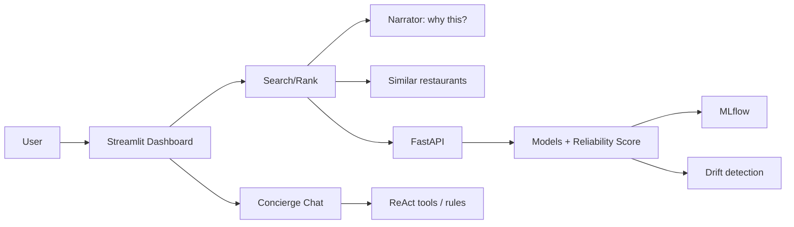

# PRD — Dabba: Restaurant Intelligence Platform

|Field|Value|
|---|---|
|Version|v0.1|
|Last Updated|2026-08-06|
|Owner|Product Manager|
|Status|In Review|

---

## 1. Executive Summary

Dabba is an India-focused restaurant ranking, recommendation, and delivery-reliability platform. It mines Zomato data for ratings, cuisine diversity, and cost signals; analyzes review sentiment with VADER; predicts delivery ETA with rigorously tuned ML models (Optuna HPO); and synthesizes a proprietary Reliability Score. It adds collaborative filtering (PyTorch matrix factorization) and an LLM layer (Anthropic Claude) for natural-language explanations and a food-concierge chat — all served through a Streamlit dashboard, a FastAPI REST API, and MLflow tracking with KS-test drift detection.

## 2. Problem Statement

- **User pain:** India's food-tech landscape generates massive restaurant and delivery data, but consumers and operators lack a unified view combining food quality, customer sentiment, and delivery reliability.
- **Evidence/context:** Rating prediction reaches R² 0.917 (RandomForest); ETA MAE ~5.8 min; reliability score = 0.4·rating + 0.3·sentiment − 0.3·delay_risk.
- **Cost of not solving it:** Poor restaurant choices, unreliable ETA expectations, and no shared "how good is this place, really?" metric.

## 3. Goals & Non-Goals

|Goal|Metric|Target|
|---|---|---|
|Predict ratings accurately|MAE (RandomForest)|≤ 0.06|
|Predict delivery ETA|MAE (min)|≤ 5.8|
|Explain recommendations|Narration coverage|100% (LLM or template)|
|Rank by reliability|Reliability score|All restaurants scored|
|Detect drift|KS-test alerts|Drift threshold configurable|

### Non-Goals (v1)
- Real-time food delivery ordering / payments.
- City-level live delivery tracking.
- Multi-language UI.
- Direct Zomato API integration (offline Kaggle datasets).

## 4. Target Users & Personas

|Persona|Role|Goals|Frustrations|Quote|Tech Comfort|
|---|---|---|---|---|---|
|Kavya — Foodie|Chooses restaurants|Find quality, reliable places|Overrated places, late deliveries|"Where should I eat tonight?"|Low|
|Arman — Restaurant Operator|Understands his market|Benchmark quality + delivery|No unified signal|"How reliable am I seen as?"|Medium|
|Nisha — Data Scientist|Extends the models|Reproducible training|Opaque pipelines|"PR metrics matter more than accuracy."|High|

## 5. User Stories

|ID|As a...|I want...|So that...|Priority|Acceptance Criteria|
|---|---|---|---|---|---|
|US-001|Foodie|search/rank restaurants|I choose well|P0|Ranking by reliability score|
|US-002|Foodie|understand "why this restaurant"|I trust the ranking|P1|Narration (LLM/template)|
|US-003|Foodie|"find me more like this"|I discover options|P1|RAG/similarity retrieval|
|US-004|Foodie|chat with the concierge|I get natural-language help|P2|ReAct tool chain or rules fallback|
|US-005|Data scientist|train + compare models|I pick the best|P0|Benchmark tables (MAE/RMSE/R²)|
|US-006|Data scientist|drift monitoring|I catch staleness|P1|KS-test alerts|

## 6. Feature List

|ID|Epic|Feature|Description|Priority|Status|
|---|---|---|---|---|---|
|REQ-001|Data|Kaggle ingestion|Zomato + delivery datasets|P0|Done|
|REQ-002|Data|Preprocessing + feature engineering|Clean features|P0|Done|
|REQ-003|ML|Rating prediction|RF/XGBoost/CatBoost/LGBM + Optuna|P0|Done|
|REQ-004|ML|ETA prediction|GBoost/LGBM/CatBoost|P0|Done|
|REQ-005|ML|Collaborative filtering|PyTorch matrix factorization|P1|Done|
|REQ-006|ML|Reliability score|Weighted formula|P0|Done|
|REQ-007|LLM|Recommendation narrator|Plain-English "why"|P1|Done|
|REQ-008|LLM|RAG similar retrieval|FAISS + cosine|P1|Done|
|REQ-009|LLM|Food concierge chat|ReAct tool chain|P2|Done|
|REQ-010|Ops|Drift detection|KS-test + alerts|P1|Done|
|REQ-011|UI|Streamlit dashboard|Ranking + explanations|P0|Done|
|REQ-012|API|FastAPI REST|Programmatic access|P0|Done|
|REQ-013|Ops|MLflow tracking|Experiment management|P0|Done|

## 7. User Journeys (high level)

## 8. Success Metrics / KPIs

|Metric|Target|Measurement|
|---|---|---|
|North Star: recommendation satisfaction|≥ 80% (survey target)|Dashboard surveys|
|Rating MAE|≤ 0.06|Benchmarks|
|ETA MAE|≤ 5.8 min|Benchmarks|
|Narration availability|100% (LLM or fallback)|Logs|
|Drift detection latency|< 1 day|Alert timestamps|

## 9. Assumptions & Dependencies

- Kaggle datasets downloadable (or cached).
- Anthropic API key optional (fallbacks for all LLM features).
- MLflow reachable.
- FAISS installed (sklearn cosine fallback).

## 10. Risks

Top 3 (full list in ../project/RiskRegister.md):
1. **LLM dependency** — mitigated by template/rules fallbacks.
2. **Data staleness** — mitigated by drift detection.
3. **FAISS availability** — mitigated by sklearn fallback.

## 11. Release Criteria

- [ ] `make setup` + `make train` produce benchmarked models.
- [ ] Dashboard renders ranking + narratives.
- [ ] API serves ranking/similar/chat endpoints.
- [ ] All LLM features degrade gracefully without API key.
- [ ] Drift detection alert fires on synthetic shift.
- [ ] Docker compose boots dashboard + API + MLflow.

## 12. Open Questions

|Question|Owner|Resolve by|
|---|---|---|
|Live Zomato API integration (vs offline datasets)?|PM|Release 2.0|
|Multi-city support?|PM|Release 2.0|

## 13. Related Documents

|Document|Relationship|
|---|---|
|[TechSpec.md](../technical/TechSpec.md)|Architecture, stack|
|[AppFlow.md](../design/AppFlow.md)|Dashboard/API flows|
|[Design.md](../design/Design.md)|Design system|
|[Schema.md](../technical/Schema.md)|Data model|
|[ImplementationPlan.md](../project/ImplementationPlan.md)|Build plan|
|[Tracker.md](../project/Tracker.md)|Task status|
|[Rules.md](../project/Rules.md)|Standards|
|[API.md](../technical/API.md)|Endpoint contracts|
|[SecurityAndCompliance.md](../technical/SecurityAndCompliance.md)|Data handling|
|[Testing.md](../technical/Testing.md)|Test strategy|
|[Deployment.md](../technical/Deployment.md)|Deployment|
|[Glossary.md](../reference/Glossary.md)|Vocabulary|
|[RiskRegister.md](../project/RiskRegister.md)|Risks|
