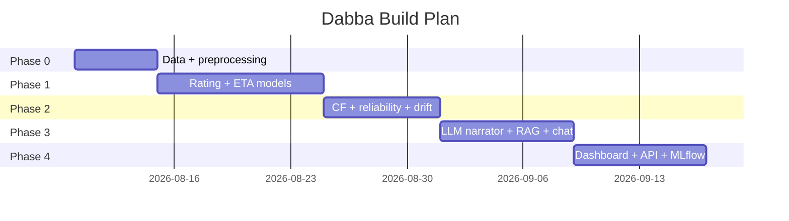
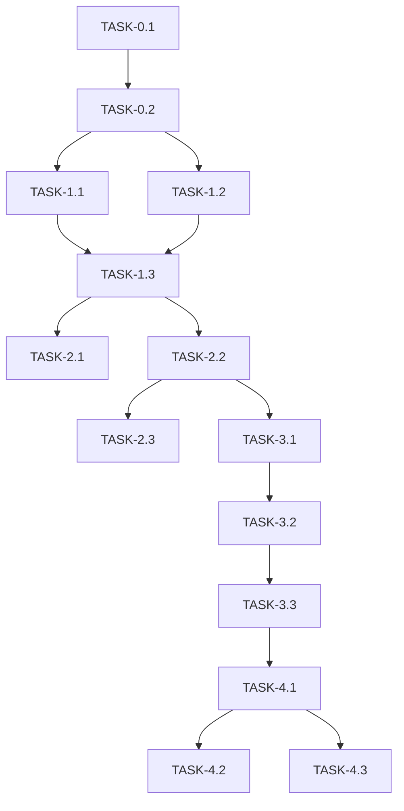

# ImplementationPlan — Dabba: Phased Build Plan

| Field | Value |
| --- | --- |
| Version | v0.1 |
| Last Updated | 2026-08-06 |
| Owner | Engineering Lead |
| Status | In Review |

---

## 1. Build Philosophy

Facts-first ML with deterministic fallbacks: data → models → reliability score → serving, with the LLM layer added last and never allowed to block core ranking.

## 2. Phase Overview

## 3. Phase Breakdown

### Phase 0: Data
- Goal: clean features + dataset cache.
- Exit: `make setup` works offline.

| TASK-# | Description | Depends on | Owner | Est. | Maps to |
| --- | --- | --- | --- | --- | --- |
| TASK-0.1 | Kaggle ingestion + cache | — | Data | 2d | REQ-001 |
| TASK-0.2 | Preprocessing + features | TASK-0.1 | Data | 3d | REQ-002 |

### Phase 1: Models
- Goal: benchmarked rating + ETA models.
- Exit: benchmark tables in README verified.

| TASK-# | Description | Depends on | Owner | Est. | Maps to |
| --- | --- | --- | --- | --- | --- |
| TASK-1.1 | Rating model + Optuna | TASK-0.2 | ML | 5d | REQ-003 |
| TASK-1.2 | ETA model + Optuna | TASK-0.2 | ML | 4d | REQ-004 |
| TASK-1.3 | Benchmark harness | TASK-1.1, TASK-1.2 | ML | 2d | REQ-005 |

### Phase 2: Reliability
- Goal: reliability score + CF + drift.
- Exit: scores computed for all restaurants.

| TASK-# | Description | Depends on | Owner | Est. | Maps to |
| --- | --- | --- | --- | --- | --- |
| TASK-2.1 | Collaborative filtering (PyTorch) | TASK-1.3 | ML | 4d | REQ-005 |
| TASK-2.2 | Reliability score formula | TASK-1.3 | ML | 2d | REQ-006 |
| TASK-2.3 | Drift detection + Slack alert | TASK-2.2 | ML | 2d | REQ-010 |

### Phase 3: LLM Layer
- Goal: narrator + RAG + chat with fallbacks.
- Exit: no-key run works fully.

| TASK-# | Description | Depends on | Owner | Est. | Maps to |
| --- | --- | --- | --- | --- | --- |
| TASK-3.1 | Narrator + template fallback | TASK-2.2 | Eng | 3d | REQ-007 |
| TASK-3.2 | FAISS RAG + sklearn fallback | TASK-3.1 | ML | 3d | REQ-008 |
| TASK-3.3 | Concierge chat + rules fallback | TASK-3.2 | Eng | 3d | REQ-009 |

### Phase 4: Serving
- Goal: dashboard + API + MLflow.
- Exit: docker-compose boots all.

| TASK-# | Description | Depends on | Owner | Est. | Maps to |
| --- | --- | --- | --- | --- | --- |
| TASK-4.1 | FastAPI endpoints | TASK-3.3 | Eng | 3d | REQ-012 |
| TASK-4.2 | Streamlit dashboard | TASK-4.1 | FE | 4d | REQ-011 |
| TASK-4.3 | MLflow wiring | TASK-4.1 | ML | 2d | REQ-013 |

## 4. Dependency Graph

## 5. Environment & Tooling Setup Checklist

- [ ] `make setup` (venv + deps)
- [ ] Kaggle API token (optional) or cached datasets
- [ ] `make train`
- [ ] `make run-app` / `make run-api`
- [ ] MLflow reachable
- [ ] Optional ANTHROPIC_API_KEY

## 6. Rollout Strategy

- All LLM features flagged by env (key present = on).
- Canary: staging first; drift monitor live from day 1.
- Rollback: pin previous model artifacts.

## 7. Definition of Done (global)

- [ ] Tests pass
- [ ] Docs updated (this suite)
- [ ] Reviewed
- [ ] No secrets committed
- [ ] Models registered in MLflow

## 8. Related Documents

| Document | Relationship |
| --- | --- |
| [PRD.md](../product/PRD.md) | REQ mapping |
| [TechSpec.md](../technical/TechSpec.md) | Components |
| [AppFlow.md](../design/AppFlow.md) | Flows |
| [Schema.md](../technical/Schema.md) | Data |
| [Design.md](../design/Design.md) | UI tasks |
| [Tracker.md](Tracker.md) | Status |
| [Rules.md](Rules.md) | Standards |
| [API.md](../technical/API.md) | Contract |
| [SecurityAndCompliance.md](../technical/SecurityAndCompliance.md) | Security |
| [Testing.md](../technical/Testing.md) | Tests |
| [Deployment.md](../technical/Deployment.md) | Rollout |
| [Glossary.md](../reference/Glossary.md) | Vocabulary |
| [RiskRegister.md](RiskRegister.md) | Risks |
