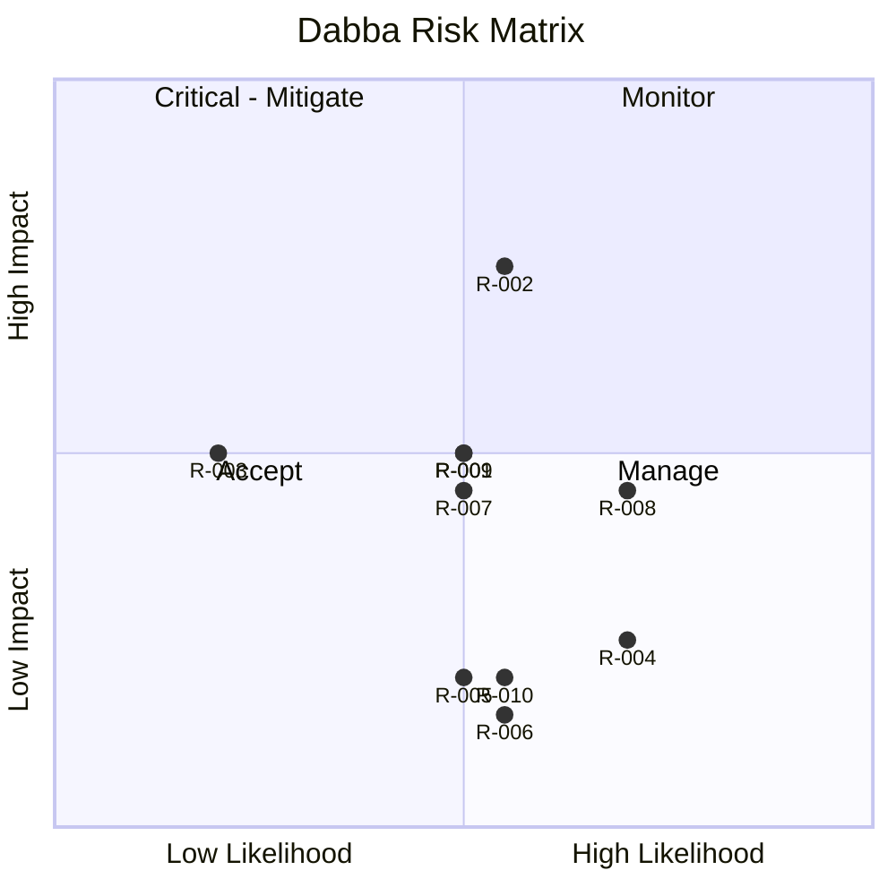

# RiskRegister — Dabba: Known Risks

|Field|Value|
|---|---|
|Version|v0.1|
|Last Updated|2026-08-06|
|Owner|PM / Eng Lead|
|Status|In Review|

---

|Risk|Likelihood|Impact|Score|Mitigation|Owner|Status|
|---|---|---|---|---|---|---|
|R-001 LLM dependency|Medium|Medium|4|Template/rules fallbacks|Eng|Mitigating|
|R-002 Data staleness|Medium|High|6|Drift detection + alerts|ML|Mitigating|
|R-003 FAISS unavailability|Low|Medium|3|sklearn fallback|Eng|Mitigating|
|R-004 .env encoding breaks local runs|High|Low|3|UTF-8 .env + docs|Eng|🔴 Open (BLK-001)|
|R-005 Kaggle quota/absence|Medium|Low|2|Cached datasets|Data|Mitigating|
|R-006 HPO cost|Medium|Low|2|Early stopping + trials budget|ML|Accepted|
|R-007 MLflow down|Medium|Medium|4|local sqlite fallback|DevOps|Accepted|
|R-008 ETA model low R²|High|Medium|4|Transparency + reliability formula|ML|Accepted|
|R-009 API abuse|Medium|Medium|4|Key auth + rate limits|Security|Mitigating|
|R-010 Nondeterministic LLM answers|Medium|Low|2|Fallbacks + labeling|Eng|Accepted|

## Risk Matrix

## Related Documents

|Document|Relationship|
|---|---|
|[PRD.md](../product/PRD.md)|Top-3 risks|
|[TechSpec.md](../technical/TechSpec.md)|R-001/002/003|
|[SecurityAndCompliance.md](../technical/SecurityAndCompliance.md)|R-009|
|[AppFlow.md](../design/AppFlow.md)|Flows|
|[Design.md](../design/Design.md)|Design|
|[Schema.md](../technical/Schema.md)|Data|
|[ImplementationPlan.md](ImplementationPlan.md)|Mitigations|
|[Tracker.md](Tracker.md)|BLK-001|
|[Rules.md](Rules.md)|Standards|
|[API.md](../technical/API.md)|R-009|
|[Testing.md](../technical/Testing.md)|Test coverage|
|[Deployment.md](../technical/Deployment.md)|Rollback|
|[Glossary.md](../reference/Glossary.md)|Vocabulary|
