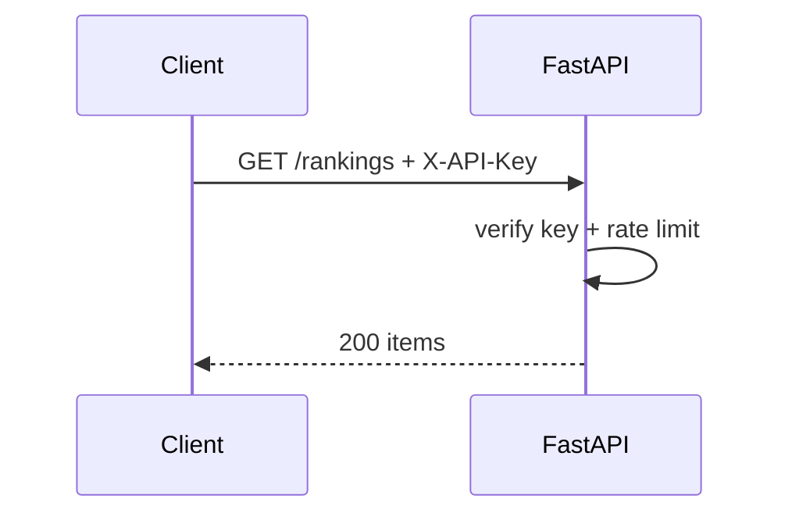

# API — Dabba: API Reference

|Field|Value|
|---|---|
|Version|v0.1|
|Last Updated|2026-08-06|
|Owner|Backend Engineer|
|Status|In Review|

---

## 1. Endpoint Inventory

|Method|Path|Auth|Description|
|---|---|---|---|
|GET|`/rankings`|API key|Ranked restaurants|
|GET|`/restaurants/{id}`|API key|Detail + score|
|GET|`/restaurants/{id}/similar`|API key|Similar restaurants|
|GET|`/restaurants/{id}/explain`|API key|"Why this" narration|
|POST|`/chat`|API key|Concierge chat|
|GET|`/models/info`|API key|Current model versions|
|GET|`/health`|None|Liveness|
|GET|`/docs`|None|OpenAPI docs|

## 2. Example: GET /rankings

Response:

```json
{
  "items": [
    {
      "id": 1,
      "name": "Spice Garden",
      "rating": 4.2,
      "reliability_score": 87.4,
      "city": "Bengaluru"
    }
  ],
  "total": 1200
}
```

## 3. Example: GET /restaurants/{id}/explain

Response:

```json
{
  "restaurant_id": 1,
  "narration": "Spice Garden scores high on food rating and sentiment, with low delivery delay risk.",
  "source": "llm"  // or "template"
}
```

## 4. Error Codes

|Code|Meaning|Retry?|
|---|---|---|
|401|Missing/invalid key|No|
|404|Restaurant not found|No|
|422|Validation error|No|
|429|Rate limited|Yes|
|503|Model unavailable|Yes|

## 5. Rate Limits

- slowapi-based; API-key + IP keyed (configurable).

## 6. Auth Flow



## 7. Versioning Policy

- v1 flat paths; /v1/ prefix planned.

## 8. Related Documents

|Document|Relationship|
|---|---|
|[TechSpec.md](TechSpec.md)|API layer|
|[Schema.md](Schema.md)|Data contracts|
|[SecurityAndCompliance.md](SecurityAndCompliance.md)|Auth|
|[AppFlow.md](../design/AppFlow.md)|Dashboard → API|
|[PRD.md](../product/PRD.md)|Requirements|
|[Design.md](../design/Design.md)|Response rendering|
|[ImplementationPlan.md](../project/ImplementationPlan.md)|Tasks|
|[Tracker.md](../project/Tracker.md)|Status|
|[Rules.md](../project/Rules.md)|Standards|
|[Testing.md](Testing.md)|Contract tests|
|[Deployment.md](Deployment.md)|Deploy|
|[Glossary.md](../reference/Glossary.md)|Vocabulary|
|[RiskRegister.md](../project/RiskRegister.md)|Risks|
