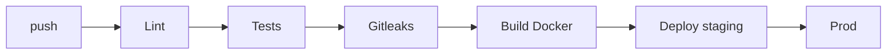

# Deployment — Dabba: Environments, CI/CD, Rollback

|Field|Value|
|---|---|
|Version|v0.1|
|Last Updated|2026-08-06|
|Owner|DevOps Engineer|
|Status|In Review|

---

## 1. Service Topology

|Service|Purpose|Port|
|---|---|---|
|dashboard|Streamlit|8501|
|api|FastAPI|8000|
|mlflow|Tracking|5000|
|postgres|DB (optional)|5432|
|redis|Cache (optional)|6379|

## 2. CI/CD Pipeline

## 3. Environment Promotion

|Step|From|To|Trigger|
|---|---|---|---|
|1|main|staging|CI green|
|2|staging|prod|manual approval|

## 4. Rollback Procedure

- Pin previous model artifacts; re-serve.
- Image revert for dashboard/api.

## 5. Feature Flags

- `ANTHROPIC_API_KEY` present → LLM features on.
- `MLFLOW_TRACKING_URI` → tracking target.
- `DRIFT_THRESHOLD` → alert sensitivity.

## 6. On-Call / Runbook

- **Rankings slow:** check model latency + cache.
- **Narration missing:** check API key + quota.
- **Drift alert:** review features, queue retrain.
- **API 401s:** verify key.

## 7. Related Documents

|Document|Relationship|
|---|---|
|[TechSpec.md](TechSpec.md)|Environments|
|[SecurityAndCompliance.md](SecurityAndCompliance.md)|Secrets|
|[PRD.md](../product/PRD.md)|Release criteria|
|[AppFlow.md](../design/AppFlow.md)|Flows|
|[Schema.md](Schema.md)|Migrations|
|[Design.md](../design/Design.md)|Design|
|[ImplementationPlan.md](../project/ImplementationPlan.md)|Rollout|
|[Tracker.md](../project/Tracker.md)|Status|
|[Rules.md](../project/Rules.md)|Standards|
|[API.md](API.md)|Endpoints|
|[Testing.md](Testing.md)|CI gates|
|[Glossary.md](../reference/Glossary.md)|Vocabulary|
|[RiskRegister.md](../project/RiskRegister.md)|Risks|
