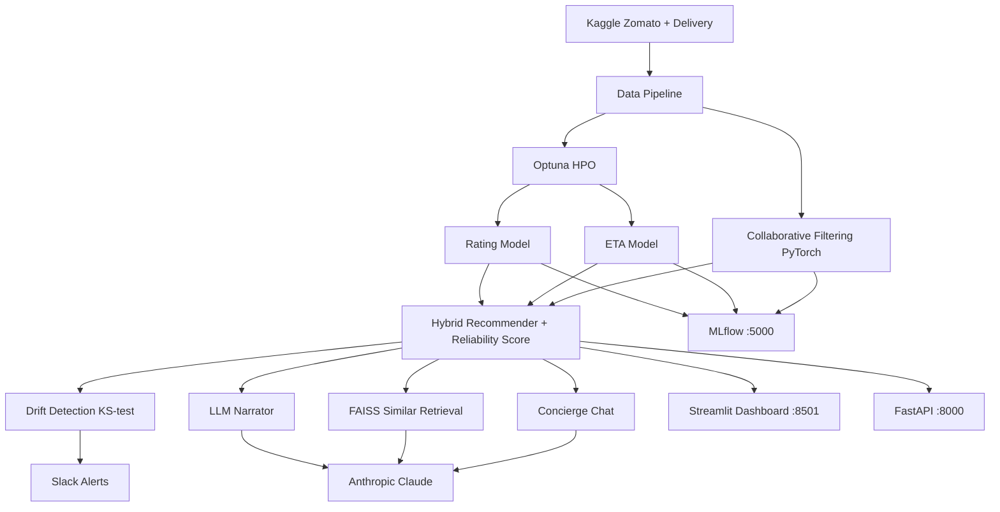
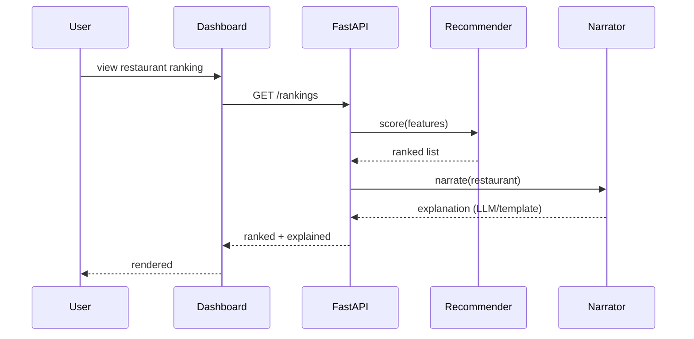
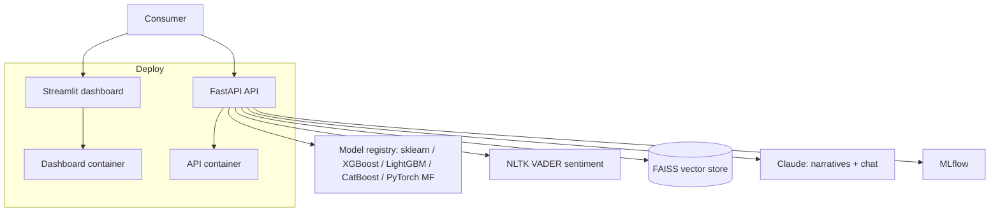

# TechSpec — Dabba: Technical Specification

| Field | Value |
| --- | --- |
| Version | v0.1 |
| Last Updated | 2026-08-06 |
| Owner | Engineering Lead |
| Status | In Review |

---

## 1. Architecture Overview



## 2. Tech Stack Table

| Layer | Technology | Version | Justification |
| --- | --- | --- | --- |
| Language | Python | 3.11 | ML ecosystem |
| ML | scikit-learn, XGBoost, LightGBM, CatBoost | — | Benchmark breadth |
| DL | PyTorch | 2.x | Matrix factorization |
| NLP | NLTK (VADER) | — | Sentiment |
| LLM | Anthropic Claude | — | Narratives + chat |
| Vector search | FAISS | — | Similar retrieval; sklearn fallback |
| Dashboard | Streamlit + Plotly | — | Analyst/consumer UI |
| API | FastAPI + Pydantic | — | Typed REST |
| Tracking | MLflow | — | Experiments + registry |
| Monitoring | scipy.stats.ks_2samp | — | Drift detection |
| HPO | Optuna (TPE) | — | Hyperparameter search |
| Alerting | Slack webhooks | — | Drift alerts |
| Testing | pytest, pytest-cov | — | Quality |
| CI/CD | GitHub Actions | — | Pipelines |

## 3. System Components

| Component | Responsibility | Inputs → Outputs | Scaling | Failure Modes |
| --- | --- | --- | --- | --- |
| Data pipeline | Ingest + clean | datasets → features | batch | source missing → cached |
| Model trainers | Train + tune | features → models | batch | HPO slow → early stop |
| Recommender | Hybrid ranking + reliability | features → score | in-process | stale features |
| Narrator | "Why this restaurant" | score → text | LLM quota | template fallback |
| RAG | Similar restaurants | query → top-k | index memory | FAISS missing → sklearn |
| Concierge chat | ReAct tool chain | question → answer | LLM quota | rules fallback |
| Drift detection | KS-test monitoring | features → alert | scheduled | n/a |
| Dashboard | Render + interact | API → charts | per-session | API down |
| API | REST surface | request → JSON | horizontal | auth/limits |

## 4. Data Flow Diagrams



```mermaid
sequenceDiagram
    participant P as Pipeline
    participant OPT as Optuna
    participant MLF as MLflow
    participant DET as Drift Detector
    P->>OPT: tune models
    OPT-->>P: best params
    P->>MLF: log runs + artifacts
    loop daily
        DET->>DET: KS-test features
        alt drift detected
            DET->>SL[Slack]: alert
        end
    end
```

## 5. Third-Party Integrations

| Service | Purpose | Failure Fallback | Cost Model | Rate Limits |
| --- | --- | --- | --- | --- |
| Anthropic Claude | Narratives + chat | Template/rules fallback | token | quota |
| Kaggle | Datasets | cached copies | free | quota |
| MLflow | Tracking | local sqlite | self-hosted | n/a |
| Slack | Drift alerts | logs | free tier | webhook |

## 6. Non-Functional Requirements

| Category | Requirement | Target | How Verified |
| --- | --- | --- | --- |
| Performance | Rank API p95 | < 300ms | API logs |
| Accuracy | Rating MAE | ≤ 0.06 | Benchmark |
| Availability | All LLM features degrade gracefully | no key → works | tests |
| Scalability | Batch training reproducible | `make train` | CI |
| Observability | MLflow runs + drift alerts | all runs logged | MLflow |

## 7. Environments

| Env | URL | Data | Deploy |
| --- | --- | --- | --- |
| dev | localhost:8501/8000 | Kaggle sample | make run-app / run-api |
| staging | staging | sample | CI |
| prod | prod | full + MLflow | docker-compose |

## 8. Error Handling Strategy

- LLM failure → template/rules fallback (never block).
- FAISS unavailable → sklearn cosine fallback.
- Kaggle missing → cached dataset.
- API: Pydantic validation → 422; rate limiting via slowapi.
- Drift: alert + log; retraining is manual in v1.

## 9. Observability

- MLflow for runs; API logs; Prometheus metrics (if wired).
- Drift alerts to Slack.
- Benchmark artifacts saved to disk.

## 10. Technical Risks & Mitigations

| Risk | Mitigation |
| --- | --- |
| LLM dependency | Fallbacks everywhere |
| Data staleness | Drift detection |
| FAISS absence | sklearn fallback |
| HPO cost | Early stopping + trials budget |

## Deployment Topology



## 11. Related Documents

| Document | Relationship |
| --- | --- |
| [PRD.md](../product/PRD.md) | Requirements |
| [Schema.md](Schema.md) | Data model |
| [API.md](API.md) | Endpoints |
| [AppFlow.md](../design/AppFlow.md) | Flows |
| [Design.md](../design/Design.md) | Dashboard |
| [ImplementationPlan.md](../project/ImplementationPlan.md) | Phases |
| [Tracker.md](../project/Tracker.md) | Status |
| [Rules.md](../project/Rules.md) | Standards |
| [SecurityAndCompliance.md](SecurityAndCompliance.md) | Data handling |
| [Testing.md](Testing.md) | Tests |
| [Deployment.md](Deployment.md) | Environments |
| [Glossary.md](../reference/Glossary.md) | Vocabulary |
| [RiskRegister.md](../project/RiskRegister.md) | Risks |
