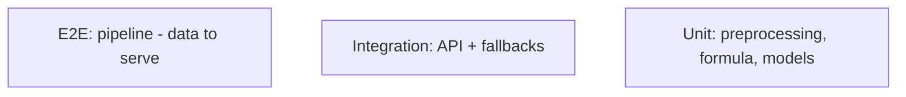

# Testing — Dabba: Test Strategy

|Field|Value|
|---|---|
|Version|v0.1|
|Last Updated|2026-08-06|
|Owner|QA Engineer|
|Status|In Review|

---

## 1. Test Pyramid

## 2. Strategy

|Layer|Tool|Scope|
|---|---|---|
|Unit|pytest|Preprocessing, reliability formula, fallbacks|
|Integration|pytest + TestClient|API endpoints, model load|
|Pipeline|make train in CI|data → models → artifacts|
|Security|pytest|auth, limits, validation|

> Note: local test collection currently errors when `.env` is non-UTF8 (box-drawing chars) on Windows — see ../project/Tracker.md BLK-001.

## 3. Critical Test Cases

|ID|Feature|Case|Expected|
|---|---|---|---|
|TC-001|Reliability|Formula weights|score = 0.4·r + 0.3·s − 0.3·d|
|TC-002|Narrator|No API key|Template fallback|
|TC-003|RAG|FAISS missing|sklearn fallback|
|TC-004|Chat|LLM down|Rules intent match|
|TC-005|API|Valid ranking request|200 items|
|TC-006|API|Missing key|401|
|TC-007|Drift|Synthetic shift|Alert triggered|
|TC-008|Preprocessing|Feature engineering|Valid shapes|

## 4. Test Data Strategy

- Kaggle sample cached for tests; synthetic fixtures for unit tests.

## 5. CI Gates

- `make test` green.
- `make lint` (ruff, black, isort).
- Coverage ≥ 60%.

## 6. Related Documents

|Document|Relationship|
|---|---|
|[Rules.md](../project/Rules.md)|Coverage requirements|
|[PRD.md](../product/PRD.md)|Release criteria|
|[TechSpec.md](TechSpec.md)|Components|
|[AppFlow.md](../design/AppFlow.md)|Flow tests|
|[Schema.md](Schema.md)|Data tests|
|[API.md](API.md)|Contract tests|
|[Design.md](../design/Design.md)|UI tests|
|[ImplementationPlan.md](../project/ImplementationPlan.md)|Test tasks|
|[Tracker.md](../project/Tracker.md)|BLK-001|
|[SecurityAndCompliance.md](SecurityAndCompliance.md)|Security tests|
|[Deployment.md](Deployment.md)|Test env|
|[Glossary.md](../reference/Glossary.md)|Vocabulary|
|[RiskRegister.md](../project/RiskRegister.md)|Risks|
